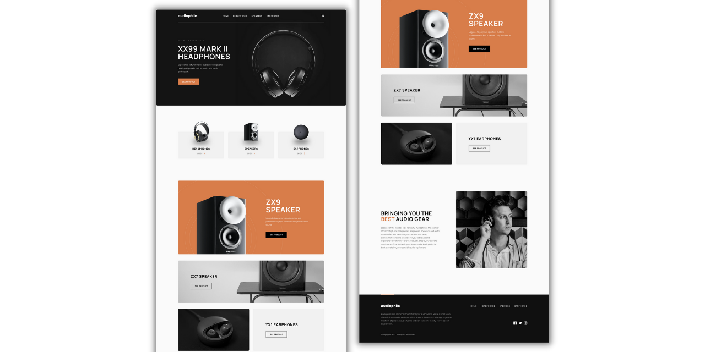
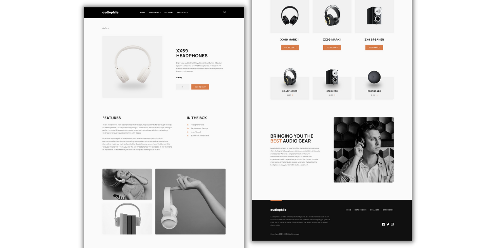
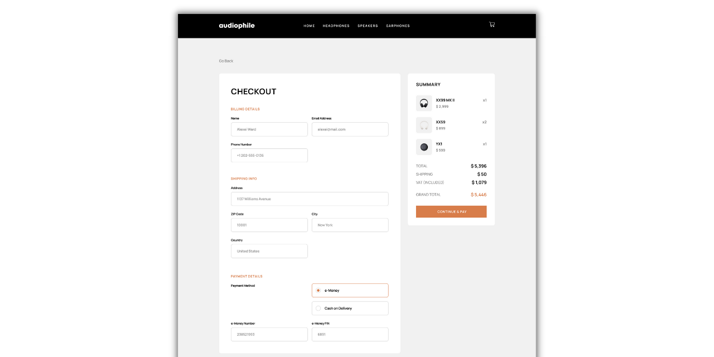

<h1 align="center">Audiophile - Vue.js E-commerce Multi-Page Website</h1>

Figma design files were provided by Frontend Mentor.

## Table of contents

- [Overview](#overview)
  - [The challenge](#the-challenge)
  - [Features](#features)
  - [Links](#links)
- [My process](#my-process)
  - [Built with](#built-with)
  - [Styled with](#styled-with)
  - [What I learned](#what-i-learned)
- [Author](#author)

## Overview

### The challenge

The requirement was to build the front-end for an online store, while making it look and behave as close as possible to the provided design. There were no requirements as to the used technologies, so I used this project as an opportunity to learn about Vue.js. A JSON file containing the product information was also provided, so making the website as dynamic as possible was also a focus point for me.

### Features

These are some of the features of my project:

- Different layouts depending on screen size
- Dynamic pages and components
- Cart (adding/removing products)
- Checkout form with form validation
- Local storage

### Links

- Live Site URL: [Audiophile](https://audiophilewebsite.netlify.app/)

## My process

### Built with

- [Vue.js](https://vuejs.org/)

### Styled with

- SCSS

### What I learned

Taking on a rather large project for my introduction to Vue.js turned out to be a good idea. This challenge not only introduced me to the basics of this framework, but also required me to research things in depth and find creative solutions. I have to say I had a lot of fun working with Vue and I'm looking forward to using it in many future projects.

I was also happy to practice my precision in building websites according to someone else's design. The Figma files provided by Frontend Mentor were very detailed, which was super helpful, but also required paying close attention to detail.

